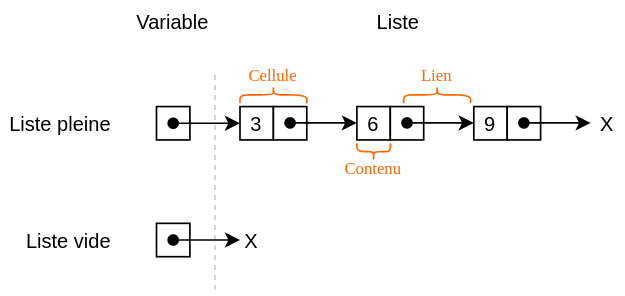

# Les listes chaïnées

## Définition générale

Une liste est un ensemble ordonné d'objets. Généralement, ces données seront de même type, mais ce n'est pas structurellement obligatoire.

## Les listes chaînées _(linked lists)_

{: .center width=40%}

Lorsque l'implémentation de la liste fait apparaître une chaîne de valeurs, chacune pointant vers la suivante, on dit que la liste est une liste **chaînée**.

{: .center}

**Implémentation choisie :**

- Une liste est caractérisée par un ensemble de cellules.
- Le lien (on dira souvent le «pointeur») de la variable est un lien vers la première cellule, qui renverra elle-même sur la deuxième, etc.
- Chaque cellule contient donc une valeur et un lien vers la cellule suivante.
- Une liste peut être vide (la liste vide est notée `x` ou bien `None` sur les schémas)

Une conséquence de cette implémentation sous forme de liste chaînée est la non-constance du temps d'accès à un élément de liste : pour accéder au 3ème élément, il faut obligatoirement passer par les deux précédents.

!!!savoir "A retenir"

    Dans une liste chaînée, le temps d'accès aux éléments n'est pas constant.

## Exemple d'implémentation minimale d'une liste chaînée

!!! savoir "Exemple fondateur : implémentation d'une **liste chainée** en POO"

    ```python linenums='1'
    class Cellule :
        def __init__(self, contenu, suivante):
            self.contenu = contenu
            self.suivante = suivante
    ```

Cette implémentation rudimentaire permet bien la création d'une liste :

```python
>>> lst = Cellule(3, Cellule(5, Cellule(1,None)))
```

La liste créée est donc : 

Mais plus précisément, on a :

{: .center}

{{initexo(0)}}

!!! example "{{ exercice() }}"

    === "Énoncé"
        Retrouvez comment accéder aux éléments 3, 5 et 1.

    === "Correction"
        {{ correction(True,
        "
        ```python
        >>> lst.contenu
        3
        >>> lst.suivante.contenu
        5
        >>> lst.suivante.suivante.contenu
        1
        ```
        "
        ) }}

On pourra remarquer que l'interface proposée à l'utilisateur n'est pas des plus pratiques...

## Et les listes de Python ???

Nous connaissons déjà les listes de Python :

```python
>>> maliste = [3, 1, -1, 42]
```

Et nous connaissons aussi (un peu) l'interface de ce type `list`, notamment avec les méthodes `append()` ou `reverse()`.  
Néanmoins, l'implémentation qui a été choisie par les concepteurs de Python de ce type `list` fait que le celui-ci se rapproche plus d'un **tableau dynamique**.

**Dans un tableau dynamique :**

- le temps d'accès à n'importe quel élément est rapide. Ce temps d'accès est constant quelque soit l'élément : on dit que l'accès est en $O(1)$.
- l'insertion d'un élément au début ou au milieu de la liste est lente : cela oblige à décaler tous les éléments à droite de celui-ci. Le temps pris par l'insertion est proportionnel au nombre d'éléments à déplacer : on dit que l'insertion est en $O(n)$.

**Dans une liste chaînée :**

- le temps d'accès à n'importe quel élément peut être lent (proportionnel à la position de l'élément dans la liste). Le temps d'accès est en $O(n)$.
- l'insertion d'un élément à l'intérieur de la liste est rapide : il y a simplement à modifier la valeur du lien de la cellule à gauche de l'endroit d'insertion. L'action d'insérer est donc en $O(1)$. Toutefois, avant d'arriver à l'endroit d'insertion, il faut avoir parcouru toutes les cellules précédentes ! Le temps total d'insertion est donc lui aussi linéaire, en $O(n)$.

Nous nous servirons parfois du type `list` de Python dans la suite de ce cours, mais il ne faut pas oublier qu'il n'est pas un «vrai» type `list`.

## Un exemple d'interface pour les listes

Imaginons que nous possédons une interface offrant les fonctionnalités suivantes :

- `Liste()` : crée une liste vide.
- `est_vide()` : indique si la liste est vide.
- `ajoute_tete()` : insère un élément en tête de liste.
- `renvoie_tete()` : renvoie la valeur de l'élément en tête de liste ET le supprime de la liste.

!!! example "{{ exercice() }}"

    === "Énoncé"

        On considère l'enchaînement d'opérations ci-dessous.

        Écrire à chaque étape l'état de la liste `lst` et la valeur éventuellement renvoyée.

        ```python
        lst = Liste()
        lst.ajoute_tete(3)
        lst.ajoute_tete(5)
        lst.ajoute_tete(1)
        lst.renvoie_tete()
        lst.est_vide()
        lst.ajoute_tete(2)
        lst.renvoie_tete()
        lst.renvoie_tete()
        lst.renvoie_tete()
        lst.est_vide()
        ```

    === "Correction"

            {{ correction(True,
            "
            ```python
            1. lst = Liste()      # lst = None
            2. lst.ajoute_tete(3) # lst = 3
            3. lst.ajoute_tete(5) # lst = 5 3
            4. lst.ajoute_tete(1) # lst = 1 5 3
            5. lst.renvoie_tete() # lst = 5 3 valeur renvoyée : 1
            6. lst.est_vide()     # valeur renvoyée : False
            7. lst.ajoute_tete(2) # lst = 2 5 3
            8. lst.renvoie_tete() # lst = 5 3 valeur renvoyée : 2
            9. lst.renvoie_tete() # lst = 3 valeur renvoyée : 5
            10. lst.renvoie_tete()# lst = None valeur renvoyée : 3
            11. lst.est_vide()    #  valeur renvoyée : True
            ```
            "
            ) }}
