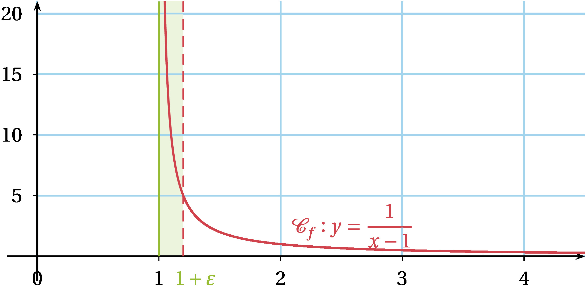
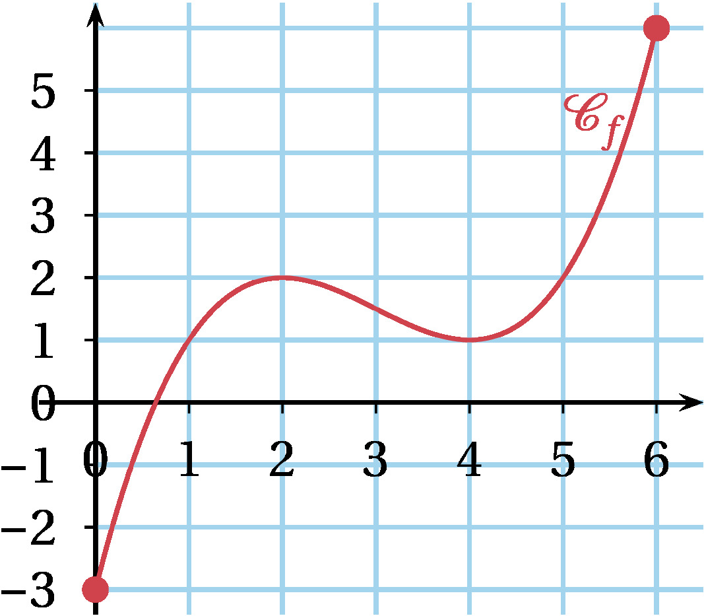
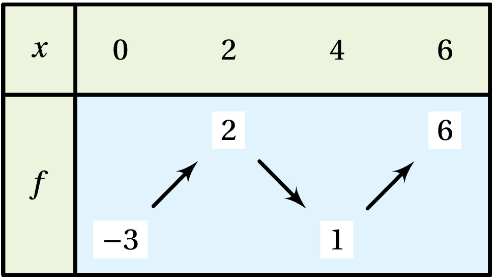
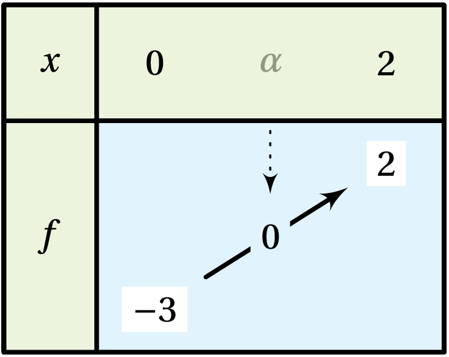

## Limite d'une fonction en l'infini

Dans toute cette partie, $\mathcal{C}_f$ désigne la courbe
représentative de la fonction $f$ dans un repère quelconque du plan.

### Limite infinie en l'infini

!!!tip "Définition "

    La fonction $f$ a pour limite $+\infty$ en $+\infty$ si tout intervalle
    de $\mathbb{R}$ du type $]a~;~+\infty[$ contient toutes les valeurs de
    $f(x)$ pour $x$ assez grand. On note alors :
    $\displaystyle\lim_{x\to+\infty}f(x)=+\infty$.

!!!example "Exemple "

    Soit $f$ la fonction racine carrée. En effet, $\sqrt{x}$ devient aussi
    grand que l'on veut à mesure que $x$ augmente.

    On a $\displaystyle\lim_{x\to+\infty}\sqrt{x}=+\infty$.

    Soit un intervalle ouvert $I=]a~;~+\infty[$. Alors, $f(x)$ sera toujours
    dans $I$ pour $x$ assez grand.

    Graphiquement, si on considère le demi-plan supérieur de frontière une
    droite d'équation $y=a$, il existe toujours une valeur
    de $a$ au delà de laquelle $\mathcal{C}_f$ ne sort plus de ce demi-plan.

    

!!!note "Remarque "

    -   On définit de façon analogue : $\displaystyle\lim_{x\to +\infty}f(x)=-\infty$,
        $\displaystyle\lim_{x\to -\infty}f(x)=+\infty$ et
        $\lim_{x\to -\infty}f(x)=-\infty$.

    -   Il existe des fonctions qui n'admettent pas de limite en l'infini.
        Par exemple, les fonctions sinus et cosinus n'admettent de limite ni
        en $+\infty$, ni en $-\infty$.

    -   Une fonction qui tend vers $+\infty$ lorsque $x$ tend vers $+\infty$
        n'est pas forcément croissante(voir observations figure 5)

### Limite finie en l'infini

!!!tip "Définition "

    Soit $f$ une fonction définie au moins sur un intervalle de $\mathbb{R}$
    du type $]a~;~+\infty[$.

    La fonction $f$ a pour limite $\ell$ en $+\infty$ si tout intervalle
    ouvert contenant $\ell$ contient toutes les valeurs de $f(x)$ pour $x$
    assez grand. On note alors : $\displaystyle\lim_{x\to+\infty}f(x)=\ell$.

!!!example "Exemple "

    Soit $f$ la fonction définie sur $]0~;~+\infty[$ par
    $f(x)=\dfrac{1}{x}+1$.

    L'inverse de $x$ se rapproche de $0$ à mesure que $x$ augmente. On a
    donc $\displaystyle\lim_{x\to+\infty}\left(\dfrac{1}{x}+1\right)=1$.

    Soit un intervalle ouvert $I$ tel que $1\in I$. Alors, $f(x)$ sera
    toujours dans $I$ pour $x$ assez grand. Graphiquement, aussi étroite que
    soit une bande parallèle à la droite d'équation $y=1$ et qui la
    contient, il existe toujours une valeur de $x$ au delà de laquelle
    $\mathcal{C}_f$ ne sort plus de cette bande.

    

!!!tip "Définition Asymptote horizontale"

    La droite d'équation $y=\ell$ est **asymptote horizontale** à
    $\boldsymbol{\mathcal{C}_f}$ **en** $\boldsymbol{+\infty}$ si
    $\displaystyle\lim_{x\to+\infty} f(x)=\ell$.

!!!note "Remarque "

    On définit de façon analogue $\displaystyle\lim_{x\to-\infty} f(x)=\ell$ qui
    caractérise une asymptote horizontale à $\mathcal{C}_f$ en $-\infty$
    d'équation $y=\ell$.

!!!example "Exemple "

    On a vu précédemment que
    $\displaystyle\lim_{x\to+\infty}\left(\dfrac{1}{x}+1\right)=1$. On a aussi
    $\displaystyle\lim_{x\to-\infty}\left(\dfrac{1}{x}+1\right)=1$.\
    Donc, la droite d'équation $y=1$ est asymptote horizontale à la courbe
    $\mathcal{C}_f$ en $+\infty$ et en $-\infty$ .

### Limites des fonctions de référence en $\infty$

!!!tip "Propriété Limites finies des fonctions usuelles en $\pm\infty$"

    Soit $n$ un entier naturel non nul.

    -   $\displaystyle\lim_{x\to+\infty}\sqrt{x}=\displaystyle\lim_{x\to+\infty}x^n=+\infty$

    -   $\displaystyle\lim_{x\to-\infty}x^n=\left\{
        \begin{array}{ll}
        +\infty &  \text{pour~} n \text{~pair} \\
        -\infty &  \text{pour~} n \text{~impair}
        \end{array}
        \right.$

    -   $\displaystyle\lim_{x\to+\infty}\frac{1}{\sqrt{x}}=\displaystyle\lim_{x\to+\infty}\frac{1}{x^n}=0$

    -   $\displaystyle\lim_{x\to-\infty}\frac{1}{x^n}=0$

    -   $\displaystyle\lim_{x\to-\infty} e^x=0$

    -   $\displaystyle\lim_{x\to+\infty} e^x=+\infty$

## Limite infinie en un réel

!!!tip "Définition "

    Soit $f$ une fonction définie sur un intervalle ouvert de $\mathbb{R}$
    du type $]x_0-\varepsilon~;~x_0[$ ou $]x_0~;~x_0+\varepsilon[$.

    La fonction $f$ a pour limite $+\infty$ en $x_0$ si tout intervalle de
    $\mathbb{R}$ du type $]A~;~+\infty[$ contient toutes les valeurs de
    $f(x)$ pour $x$ assez proche de $x_0$. On note alors :
    $\displaystyle\lim_{x\to x_0}f(x)=+\infty$.

!!!example "Exemple "

    Soit $f$ la fonction définie sur $]1~;~+\infty[$ par
    $f(x)=\dfrac{1}{x-1}$.

    Si $x$ tend $1$, alors $x-1$ tend vers $0$ et son inverse tend vers
    $+\infty$.On a $\displaystyle\lim_{x\to 1}\dfrac{1}{x-1}=+\infty$.

    Soit un intervalle ouvert $I=]1~;~1+\varepsilon[$. Alors, $f(x)$ sera
    toujours dans $I$ pour $x$ assez proche de $x_0$. Graphiquement,
    $\mathcal{C}_f$ peut être aussi proche que l'on veut de la droite
    d'équation $x=1$.

    

!!!tip "Définition Asymptote verticale"

    La droite d'équation $x=x_0$ est **asymptote verticale** à
    $\boldsymbol{\mathcal{C}_f}$ si $\displaystyle\lim_{x\to x_0} f(x)=\pm\infty$.

!!!example "Exemple "

    On a vu précédemment que $\displaystyle\lim_{x\to 1}\dfrac{1}{x-1}=+\infty$.\
    Donc, la droite d'équation $x=1$ est asymptote verticale à l'hyperbole
    $\mathcal{C}_f$.

!!!note "Remarque "

    -   Lorsque $x$ tend vers $x_0$, cela peut parfois se faire en
        augmentant ou en diminuant. On parle alors de limite de $f$ à gauche
        (resp. droite) en $x_0$ qu'on note
        $\displaystyle\lim_{\substack{x\to x_0\\ x<x_0}}f(x)$ (resp.
        $\displaystyle\lim_{\substack{x\to x_0\\ x>x_0}}f(x)$).

    -   Une fonction admet une limite en $x_0$ si, et seulement si, $f$
        admet des limites à droite et à gauche en $x_0$ qui sont égales (ce
        qui n'est pas toujours le cas).

    -   Une fonction peut très bien ne pas avoir de limite du tout en un
        point.

        Par exemple, la fonction $x \mapsto \sin \dfrac{1}{x}$ n'a pas de
        limite en 0.

!!!tip "Propriété Limites finies des fonctions usuelles en 0"

    Soit $n$ un entier naturel non nul.

    -   $\displaystyle\lim_{\substack{x\to 0\\ x>0}}\frac{1}{\sqrt{x}}=\displaystyle\lim_{\substack{x\to 0\\ x>0}}\frac{1}{x^n}=+\infty$

    -   $\displaystyle\lim_{\substack{x\to 0\\ x<0}}\dfrac{1}{x^n}=\left\{
        \begin{array}{ll}
        +\infty &  \text{pour~} n \text{~pair} \\
        -\infty &  \text{pour~} n \text{~impair}
        \end{array}
        \right.$

!!!note "Remarque "

    L'aperçu de la courbe représentative d'une fonction avec une
    calculatrice ou un logiciel peut aider à conjecturer une limite (et donc
    éventuellement une asymptote à la courbe).

Soit $f$ une fonction dont on a un aperçu du graphe $\mathcal{C}$.

Déterminer son ensemble de définition $\mathcal{D}$, puis conjecturer les limites aux bornes de $\mathcal{D}$ et les asymptotes à $\mathcal{C}$.

1. $f:x\mapsto \dfrac{x^3-1}{x^3+1}$

2. $f:x\mapsto 2x-\sqrt{4x^2-1}$

**Correction**

**1.** $\mathcal{D}=\mathbb{R}\setminus\{-1\}$. A priori, on aurait :
$\displaystyle\lim_{x\to\pm+\infty}f(x)=1$ ;
$\displaystyle\lim_{\substack{x\to -1\\ x<-1}}f(x)=+\infty$ et
$\displaystyle\lim_{\substack{x\to -1\\ x>-1}}f(x)=-\infty$.

$\mathcal{C}$ aurait alors une asymptote horizontale d'équation $y=1$ en
$\pm\infty$ et une asymptote verticale d'équation $x=-1$.

**2.**
$\mathcal{D}=]-\infty~;~-\tfrac{1}{2}[\,\cup\,]\tfrac{1}{2}~;~+\infty[$.
On a : $\displaystyle\lim_{x\to -1/2}f(x)=-1$ et $\displaystyle\lim_{x\to 1/2}f(x)=1$ et, il
semblerait que $\displaystyle\lim_{x\to-\infty}f(x)=-\infty$ et
$\displaystyle\lim_{x\to +\infty}f(x)=0$.

$\mathcal{C}$ aurait alors une asymptote horizontale d'équation $y=0$
(l'axe des abscisses) en $+\infty$.

# Opérations sur les limites

!!!tip "Limite d'une somme"

    | $f$    | $g$     | $f+g$        |
    |--------|---------|--------------|
    | $\ell$ | $\ell'$ | $\ell+\ell'$ |
    |     $\ell$     |      $\infty$     |        $\infty$      |
    |     $+\infty$    |      $-\infty$    |        $-\infty$       |
    | $-\infty$  | $-\infty$  | $-\infty$ |
    | $+\infty$| $-\infty$ | $???$|

!!!tip "Limite d'un produit"

    $\ell$ * $\ell'$  :  $\ell\ell'$

    $\ell\!\neq\!0$   *    $\infty$   : $\infty$

    $\infty$   *        $\infty$ :   $\infty$

     $0$* $\infty$ : $???$

!!!tip "Limite d'un quotient"

    $\ell$      /        $\ell'\!\neq\!0$ :  $\ell/\ell'$

    $\ell\!\neq\!0$     /           $0$    :        $\infty$

    $\ell$        /          $\infty$     :      $0$

    $0$      /      $0$      /       $???$

    $\infty$ / $\infty$ : $???$

!!!note "Remarque "

    - $\infty$ peut signifier $+\infty$ ou $-\infty$. Les règles du signe
    d'un produit ou d'un quotient demeurent.

    - Pour la limite de la différence $f-g$, on considère la limite de la
    somme $f+(-g)$.

!!!savoir "quatre cas d'indétermination"

    - " $\boldsymbol{(+\infty)+(-\infty)}$ "

    - " $\boldsymbol{0\times\infty}$ "

    - " $\boldsymbol{\dfrac{0}{0}}$ "

    - " $\boldsymbol{\dfrac{\infty}{\infty}}$ "

!!!example "Exemple "

    Soit $f:x\mapsto  \frac{x-1}{x^2-4}$. Calculons les limites de $f(x)$
    aux bornes de son domaine de définition.

## Limite d'une fonction composée

### **Fonction composée**

Une composée de deux fonctions correspond à un enchaînement de deux
fonctions l'une après l'autre.

Par exemple, composons la fonction $f:x\mapsto1-x$ suivie de
$g:x\mapsto\sqrt{x}$. On peut ainsi schématiser :

---

$x$ $\,\mapsto\,$ $1-x$ $\,\mapsto\,$ $\sqrt{1-x}$.
$f$ $g$

---

Cependant, on voit que la fonction $g$ ne peut s'appliquer que si
l'ensemble des images par la fonction $f$ est inclus dans l'ensemble de
définition de $g$.

Ainsi, pour appliquer ici la racine carrée, il faut que $1-x\geqslant0$
c'est-à-dire que $x\leqslant1$.

La composée existe donc dans le schéma suivant où on précise les
ensembles de départ et d'arrivée pour $f$ :

---

$]-\infty~;~2]$ $\rightarrow$ $[0~;~+\infty[$ $\rightarrow$ $\mathbb{R}$
$x$ $\,\mapsto\,$ $1-x$ $\,\mapsto\,$ $\sqrt{1-x}$
$f$ $g$

---

En composant $f$ suivie de $g$, on a ainsi défini sur $]-\infty~;~1]$ la
fonction $x\mapsto\sqrt{1-x}$.

!!!tip "Définition "

    Soit $f$ une fonction définie sur $E$ et à valeurs dans $F$, et soit $g$
    une fonction définie sur $F$.

    **La composée de** $\boldsymbol{f}$ **suivie de** $\boldsymbol{g}$ est
    la fonction notée $\boldsymbol{g\circ f}$ définie sur $E$ par
    $g\circ f(x)=g(f(x))$.

!!!note "Remarque "

    Il ne faut pas confondre $g\circ f$ et $f\circ g$ qui sont, en général,
    différentes.

!!!example "Exemple "

    En reprenant $f$ et $g$ de l'exemple précédent, définissons $f\circ g$.

    La composée de $g$ suivie de $f$ est possible en partant de l'ensemble
    de définition de $g$ :

    ---

    $[0~;~+\infty[$ $\rightarrow$ $[0~;~+\infty[$ $\rightarrow$ $\mathbb{R}$

    $x$ $\,\mapsto\,$ $\sqrt{x}$ $\,\mapsto\,$ $1-\sqrt{x}$

    ---

    En composant $g$ suivie de $f$, on a ainsi défini sur $[0~;~+\infty[$ la
    fonction $x\mapsto1-\sqrt{x}$.

### Théorème de composition des limites

!!!tip "Théorème "

    Soit $h$ la composée de la fonction $f$ suivie de $g$ et
    $\alpha$, $\beta$ et
    $\gamma$ trois réels ou $\pm\ \infty$.

    Si $\displaystyle\lim_{x\to\alpha} f(x)=\beta$ et
    $\displaystyle\lim_{x\to\beta} g(x)=\gamma$,
    alors
    $\displaystyle\lim_{x\to\alpha} h(x)=\gamma$.

!!!example "Exemple "

    Déterminons la limite en $-\infty$ de la fonction $g\circ f$ de
    l'exemple précédent.

    La composée de $f:x\mapsto 1-x$ suivie de $g:x\mapsto\sqrt{x}$ est
    $h:x\mapsto \sqrt{1-x}$ définie sur $]-\infty~;~1]$.

    Or, $\displaystyle\lim_{x\to -\infty} (1-x)=+\infty$
    (par somme) et
    $\displaystyle\lim_{x\to +\infty}  \sqrt{x}=+\infty$
    (limite de référence).

    Donc, d'après le théorème de composition,
    $\displaystyle\lim_{x\to -\infty} \sqrt{1-x}=+\infty$.

!!!faq "Méthode Déterminer une limite de fonction "

    On applique les propriétés d'opérations sur les limites.

    Si la limite est indéterminée, " $+\infty+(-\infty)$ ", "
    $0\times\infty$ ", " $\dfrac{\infty}{\infty}$ " ou " $\dfrac{0}{0}$
    ", on essaye de :

    - factoriser par le terme prépondérant ;

    - multiplier par la quantité conjuguée si des racines carrées
    interviennent ;

    - effectuer un changement de variable (voir théorème de composition
    des limites).

    D'autres techniques existent et seront vues ultérieurement.

    **Exercice:**

    Calculer les limites suivantes :

    **1.** $\displaystyle\lim_{x\to+\infty}\left(\sqrt{x+1}-\sqrt{x}\right)$

    **2.** $\displaystyle\lim_{x\to+\infty}\dfrac{2x^2-3x+1}{x^2-1}$

    **3.** $\displaystyle\lim_{x\to4}\dfrac{x - 4}{\sqrt{x} - 2}$

    **Correction**

    Ces limites sont indéterminées (respectivement formes " $\infty-\infty$
    ", " $\dfrac{\infty}{\infty}$ " et " $\dfrac{0}{0}$ ").

    **1.** On multiplie le numérateur et le dénominateur par la quantité
    conjuguée de $\sqrt{x+1}-\sqrt{x}$ :

    $\sqrt{x+1}-\sqrt{x}=\dfrac{\left(\sqrt{x+1}-\sqrt{x}\right)\left(\sqrt{x+1}+\sqrt{x}\right)}{\sqrt{x+1}+\sqrt{x}}=\dfrac{1}{\sqrt{x+1}+\sqrt{x}}$.

    Or, par composition :
    $\displaystyle\lim_{x\to +\infty}(x+1)=\infty$ et
    $\displaystyle\lim_{x\to +\infty}\sqrt{x}=+\infty$
    donc
    $\displaystyle\lim_{x\to +\infty}\sqrt{x+1}=\infty$.

    Et, par somme :
    $\displaystyle\lim_{x\to+\infty}\left(\sqrt{x+1}+\sqrt{x}\right)=+\infty$. Donc, par
    inverse : $\displaystyle\lim_{x\to+\infty}\dfrac{1}{\sqrt{x+1}+\sqrt{x}}=0$.

    **2.** Divisons le numérateur et le dénominateur par $x^2$. Alors,
    $\dfrac{2x^2-3x+1}{x^2-1}=
    \dfrac{2-\tfrac{3}{x}+\tfrac{1}{x^2}}{1-\tfrac{1}{x^2}}$.

    Or, par somme :
    $\displaystyle\lim_{x\to+\infty}\left(2-\dfrac{3}{x}+\dfrac{1}{x^2}\right)=2$ et
    $\displaystyle\lim_{x\to+\infty}\left(1-\dfrac{1}{x^2}\right)=1$.

    Donc, par quotient :
    $\displaystyle\lim_{x\to+\infty}\dfrac{2-\tfrac{3}{x}+\tfrac{1}{x^2}}{1-\tfrac{1}{x^2}}=2$.

    **3.** Changeons de variable en posant $u=\sqrt x$. Si $x$ tend vers
    $4$, alors $u$ tend vers $2$.

    $\dfrac{x-4}{\sqrt x-2}=\dfrac{u^2-4}{u-2}=\dfrac{(u+2)(u-2)}{u-2}=u+2$
    pour $u\neq2$. Donc, par somme : $\displaystyle\lim_{u\to2}(u+2)=4$.

## Limites et comparaison

### Théorème de comparaison

!!!tip "Théorème "

    Soit $f$ et $g$ deux fonctions telles que $f(x)\leqslant g(x)$ sur un
    intervalle $]\alpha~;~+\infty[$ de $\mathbb{R}$.

    - $\displaystyle\lim_{x\to+\infty} f(x)=+\infty\Rightarrow\displaystyle\lim_{x\to+\infty} g(x)=+\infty$.

    - $\displaystyle\lim_{x\to+\infty} g(x)=-\infty\Rightarrow\displaystyle\lim_{x\to+\infty} f(x)=-\infty$.

    Soit $f$ et $g$ deux fonctions telles que $f(x)\leqslant g(x)$ sur un
    intervalle $]-\infty~;~\beta[$ de $\mathbb{R}$.

    - $\displaystyle\lim_{x\to-\infty} f(x)=+\infty\Rightarrow\displaystyle\lim_{x\to-\infty} g(x)=+\infty$.

    - $\displaystyle\lim_{x\to-\infty} g(x)=-\infty\Rightarrow\displaystyle\lim_{x\to-\infty} f(x)=-\infty$.

    Soit $f$ et $g$ deux fonctions telles que $f(x)\leqslant g(x)$ sur un
    intervalle $]\alpha~;~\beta[$ de $\mathbb{R}$ et
    $x_0\in]\alpha~;~\beta[$.

    - $\displaystyle\lim_{x\to x_0} f(x)=+\infty\Rightarrow\displaystyle\lim_{x\to x_0} g(x)=+\infty$.

    - $\displaystyle\lim_{x\to x_0} g(x)=-\infty\Rightarrow\displaystyle\lim_{x\to x_0} f(x)=-\infty$.

!!!example "Exemple "

    Déterminons la limite en $+\infty$ et en $-\infty$ de $f(x)=x+\sin x$.

    La limite de $\sin x$ en $\pm \infty$ est indéterminée donc, celle de
    $f(x)$ aussi.

    Mais pour tout $x\in\mathbb{R}$, $-1\leqslant\sin x\leqslant 1$ donc
    $x-1\leqslant x+\sin x\leqslant x+1$. Ainsi :

    - De $x-1\leqslant x+\sin x$   et  
    $\displaystyle\lim_{x\to +\infty} (x-1)=+\infty$, on déduit que
    $\displaystyle\lim_{x\to +\infty} (x+\sin x)=+\infty$.

    - De $x+\sin x\leqslant x+1$   et  
    $\displaystyle\lim_{x\to -\infty} (x+1)=-\infty$, on déduit que
    $\displaystyle\lim_{x\to -\infty} (x+\sin x)=-\infty$.

### Conséquence : croissance comparée

!!!tip "Théorème "

    Pour tout entier naturel $n$,
    $\displaystyle\lim_{n\rightarrow +\infty} \frac{e^x}{x^n}=+\infty$.

[Démonstration]{.underline} :

Pour tout réel $y$, $y<e^y$.

On pose : $y=\frac{x}{n+1}$. L'inégalité devient:
$\frac{x}{n+1}<^{\frac{x}{n+1}}$.

La fonction $t \mapsto t^{n+1}$ est strictement croissante sur
$[0 ; +\infty[$.

Donc :

$\left(\frac{x}{n+1}\right)^{n+1}<\left(^{\frac{x}{n+1}}\right)^{n+1} \iff \frac{x^{n+1}}{(n+1)^{n+1}}<e^x \iff \frac{x}{(n+1)^{n+1}}<\frac{e^x}{x^n}$.

Or, $\displaystyle\lim_{x\rightarrow+\infty} \frac{x}{(n+1)^{n+1}}=+\infty$, donc
d'après le théorème de comparaison,
$\displaystyle\lim_{x\rightarrow+\infty} \frac{e^x}{x^n}=+\infty$.

### Théorème d'encadrement dit " des gendarmes "

!!!tip "Théorème "

    Soit deux réels $\alpha$ et $\ell$ et trois fonctions $f$, $g$ et $h$
    telles que, pour $x>\alpha$, on a $f(x)\leqslant g(x)\leqslant h(x)$.

    Si $\displaystyle\lim_{x\rightarrow+\infty}f(x)=\displaystyle\lim_{x\rightarrow+\infty}h(x)=\ell$,
    alors $\displaystyle\lim_{x\rightarrow+\infty}g(x)=\ell$.

!!!note "Remarque "

    On a, comme pour le théorème de comparaison précédent, deux théorèmes
    analogues lorsque $x$ tend vers $-\infty$ et lorsque $x$ tend vers un
    réel $x_0$.

!!!example "Exemple "

    Déterminons la limite en $-\infty$ de $f(x)=\dfrac{x\cos x}{x^2+1}$.

    La limite de $\cos x$ en $-\infty$ est indéterminée. Donc celle de
    $f(x)$ aussi.

    Cependant pour tout $x$ réel strictement négatif,
    $-1\leqslant\cos x\leqslant 1$ donc $x\leqslant x\cos x\leqslant -x$.

    Et en divisant membre à membre par $x^2+1>0$ on a :
    $\dfrac{x}{x^2+1}\leqslant \dfrac{x\cos x}{x^2+1}\leqslant \dfrac{-x}{x^2+1}$.

    Pour $x\in\mathbb{R}^*$, $\dfrac{x}{x^2+1} = \dfrac{1}{x+\tfrac{1}{x}}$.

    Or, $\displaystyle\lim_{x\rightarrow-\infty}\left(x+\frac{1}{x}\right) = -\infty$
    donc
    $\displaystyle\lim_{x\rightarrow-\infty}\dfrac{x}{x^2+1} = \displaystyle\lim_{x\rightarrow-\infty}\dfrac{-x}{x^2+1}=0$.

    Donc, d'après le théorème des gendarmes,
    $\displaystyle\lim_{x\rightarrow-\infty}\dfrac{x\cos x}{x^2+1}=0$.

## Continuité d'une fonction

!!!tip "Définition "

    Soit $f$ une fonction définie sur un intervalle $I$ et un réel
    $x_{0}\in I$.

    - $f$ est **continue en** $x_{0}$ si
    $\displaystyle\lim_{x\to x_0}f(x)=f(x_0)$.

    - $f$ est **continue sur** $\boldsymbol{I}$ si, pour tout $x\in I$,
    $f$ est continue en $x$.

!!!note "Remarque "

    On peut considérer qu'une fonction est continue sur un intervalle $I$ si
    sa courbe représentative sur $I$ peut être tracée entièrement sans lever
    le crayon.

!!!tip "Propriété "

    - Les fonctions usuelles (affines, carré, inverse, racine carrée,
    valeur absolue) sont continues sur tout intervalle inclus dans leur
    ensemble de définition.

    - Toute fonction construite algébriquement (par somme, produit,
    inverse ou composée) à partir de fonctions usuelles est continue sur
    tout intervalle de son ensemble de définition.

    - On convient qu'une flèche oblique dans un tableau de variation
    traduit la continuité et la stricte monotonie de la fonction sur
    l'intervalle considéré.

    - Une fonction dérivable sur un intervalle est continue sur cet
    intervalle.

!!!note "Remarque "

    Attention, la réciproque de cette dernière propriété est fausse.\
    Par exemple, la fonction valeur absolue $x\mapsto |x|$ est continue en 0
    mais non dérivable en 0.

!!!example "Exemple "

    Par convention, une fonction est continue là où elle est tracée. S'il
    n'y a pas continuité en $x_0$ :

    - le symbole [$\bullet$]{style="color: B2"} indique le point de la
    courbe de coordonnées $(x_0~;~f(x_0))$ ;

    - le symbole
    [$\bullet$]{style="color: white"}[$\boldsymbol{\circ}$]{style="color: B2"}
    indique un point qui n'appartient pas à la courbe mais dont
    l'ordonnée est égale à la limite à gauche ou à droite en $x_0$.

    Soit la fonction $f$ représentée ci-dessous.

    

    $f$ est " affine par morceaux ". $\mathcal{C}_f$ a un " saut " en 0
    donc $f$ n'est pas continue sur $[-3~;~3]$ mais elle est continue sur
    $[-3~;~0]$ et $]0~;~3]$. En effet, on a $f(0)=-1$ mais
    $\displaystyle\lim_{\substack{x\to 0\\ x>0}} f(x)=1$.

## Théorème des valeurs intermédiaires

!!!tip "Théorème Cas général"

    Soit $f$ une fonction définie sur un intervalle $I$ contenant deux réels
    $a$ et $b$ tels que $a<b$.

    Si $f$ est continue sur $[a~;~b]$, alors pour tout réel $k$ compris
    entre $f(a)$ et $f(b)$, il existe au moins un réel $c$ appartenant à
    $[a~;~b]$ tel que $f(c)=k$.

!!!note "Remarque "

    $f$ prend au moins une fois toute valeur intermédiaire entre $f(a)$ et
    $f(b)$.

    Autrement dit, l'équation $f(x)=k$ a au moins une solution dans
    $[a~;~b]$ et, sur $[a~;~b]$, la courbe représentative de $f$ coupe la
    droite d'équation $y=k$ en un point au moins.

!!!example "Exemple "

    Soit $f$ la fonction définie sur $[0~;~6]$ par
    $f(x)=\dfrac{x^3}{4}-\dfrac{9}{4}x^2+6x-3$.

    

    On dresse le tableau de variation de $f$.

    $f$ admet pour minimum $-3$ et pour maximum 6.

    $f$ est continue sur $[0~;~6]$.

    

    Donc, d'après le théorème des valeurs intermédiaires, $f$ prend toutes
    les valeurs de $[-3~;~6]$. En particulier, l'équation
    $f(x)=0$ a au moins une solution dans $[0~;~6]$.

!!!tip "Théorème Cas d'une fonction strictement monotone"

    Soit $f$ une fonction définie sur un intervalle $I$ contenant deux réels
    $a$ et $b$ tels que $a<b$.

    Si $f$ est continue et **strictement monotone** sur $[a~;~b]$, alors
    pour tout réel $k$ compris entre $f(a)$ et $f(b)$, il existe **un
    unique** réel $c$ appartenant à $[a~;~b]$ tel que $f(c)=k$.

!!!example "Exemple "

    Reprenons la fonction $f:x\mapsto\dfrac{x^3}{4}-\dfrac{9}{4}x^2+6x-3$.

    

    

    Sur $[0~;~2]$, $f$ est continue, strictement croissante et admet pour
    minimum $-3$ et maximum $2$.

    Donc, $f$ prend une fois, et une seule, toutes les valeurs
    intermédiaires entre $-3$ et 2.

    En particulier, l'équation $f(x)=0$ a une unique solution $\alpha$ entre
    0 et 2.

!!!note "Remarque "

    Le théorème des valeurs intermédiaires s'applique aussi pour $f$
    continue sur un intervalle $I$ de type : $[a~;~b[$, $]a~;~b]$,
    $]a~;~b[$, $[a~;~+\infty[$, $]a~;~+\infty[$, $]-\infty~;~b]$ ou
    $]-\infty~;~b[$, $]-\infty\ ;\ +\infty[$.

    Si une borne $a$ ou $b$ de l'intervalle est ouverte, alors on remplace
    $f(a)$ ou $f(b)$ par la limite de $f$ en cette borne ; si une borne de
    l'intervalle est $\pm\infty$, alors on considère la limite de $f$ en
    $\pm\infty$.

=== "Exploiter le théorème des valeurs intermédiaires"

    Le théorème des valeurs intermédiaires (T.V.I.) est utile pour prouver
    l'existence d'une solution d'une équation du type
    $f(x)=k$ et dénombrer ces solutions.Pour cela:

    - On dresse le tableau de variation de la fonction $f$ ;

    - On applique le T.V.I. à chaque intervalle où la fonction est
    strictement monotone.

    Dénombrer les solutions de l'équation (E) : $x^4+3x^3+x^2+1=0$.

=== "Correction"

    $f:x\mapsto x^4+3x^3+x^2+1$ est une fonction polynôme de degré 4
    dérivable sur $\mathbb{R}$.

    $f'(x)=4x^3+9x^2+2x=x(4x^2+9x+2)=x(x+2)(4x+1)$ après factorisation du
    trinôme.

    On établit alors le tableau de signes de $f'(x)$ et de variation de $f$
    :

    

    Sur $]-\infty~;~-2]$, $f$ est continue, strictement décroissante et :
    $\displaystyle\lim_{x\to-\infty}f(x)=+\infty$ ; $f(-2)=-3$.

    Donc, d'après le T.V.I., l'équation (E) a une unique solution
    $\alpha$ inférieure à $-2$.

    Sur $\left[-2~;~-\frac{1}{4}\right]$ , $f$ est continue, strictement
    croissante et : $f(-2)=-3$ ; $f\left(-\frac{1}{4}\right)\approx1,02>0$.

    Donc, d'après le T.V.I., l'équation (E) a une unique solution
    $\beta$ comprise entre $-2$ et
    $-\frac{1}{4}$.

    Sur $\left[-\frac{1}{4}~;~0\right]$ et $\left[0~;~+\infty\right[$, le
    minimum de $f$ est $1>0$ donc on n'y trouve pas de solution.

    Conclusion : l'équation (E) admet exactement deux solutions dans
    $\mathbb{R}$.

## Fonction continue et suite convergente

!!!tip "Théorème "

    Soit une fonction $f$ définie et continue sur un intervalle $I$ et une
    suite $(u_n)$ telle que pour tout entier naturel $n$,on a : $u_n \in I$
    et $u_{n+1}=f(u_n)$.

    Si $(u_n)$ converge vers $l$ de $I$, alors $f(l)=l$.

    Autrement dit : $l$ est solution de l'équation $f(x)=x$.

!!!example "Exemple"

    Soit la suite $(u_n)$ définie pour tout entier naturel $n$ par $u_0=0$
    et $u_{n+1}=\sqrt{3u_n+4}$.

    On peut démontrer par récurrence que $(u_n)$ est croissante et majorée
    par 4. (on l'admet sur cet exemple). Donc $(u_n)$ converge (théorème de
    convergence des suites monotones).

    la fonction $f$ associée est $f: x \mapsto \sqrt{3x+4}$.

    $f$ est continue sur $[-\frac{4}{3} ; +\infty[$ comme composée de
    fonctions continues sur cet intervalle. ($f=g\circ h$, avec
    $h : x \mapsto 3x+4$ et $g:x \mapsto \sqrt{x}$)

    Soit $l=\displaystyle\lim_{n \to +\infty} u_n$. $l$ est solution de l'équation :
    $l=f(l) \iff l=\sqrt{3l+4}$.

    Déterminons $l$.

    $l$ existe ssi $3l+4 \geq 0$ ssi $l \geq -\frac{4}{3}$.

    $l=\sqrt{3l+4} \Rightarrow l^2=3l+4 \iff l^2-3l-4=0$.

    $\Delta=25$ . $l_1=-1$ et $l_2=4$.

    Or, $u_0=0$ et $(u_n)$ est croissante donc la seule possibilité est
    $l_2=4$.

    la limite de la suite $(u_n)$ est 4.
