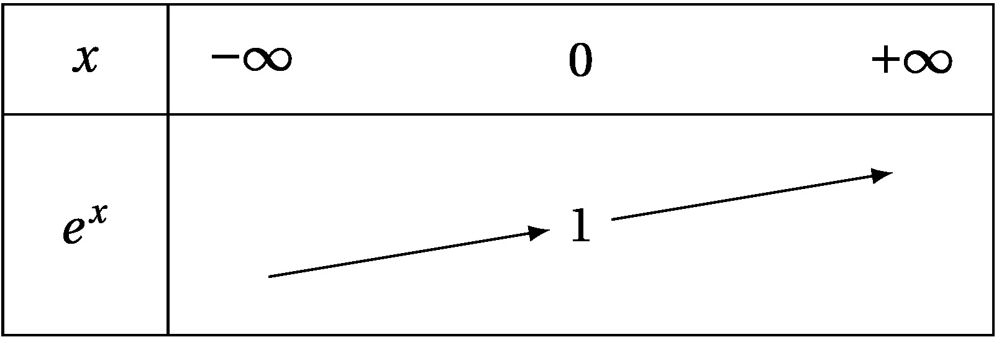
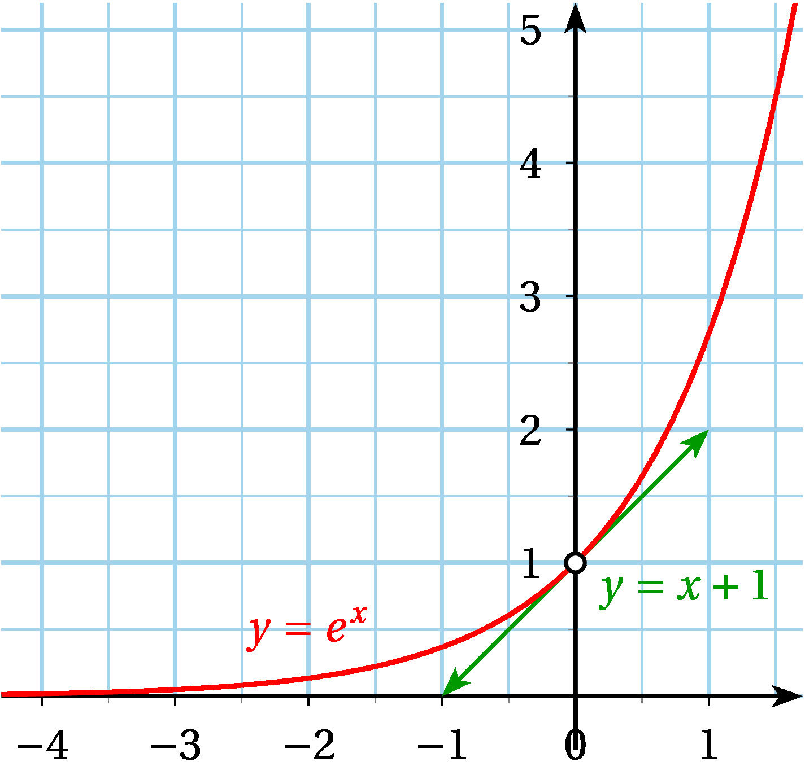

# Généralités sur la fonction exponentielle

## Définition

!!!tip "Théorème"

    Il existe une unique fonction $f$ définie et dérivable sur $\mathbb{R}$
    vérifiant, pour tout nombre réel $x$,:

    $\boxed{f'(x)=f(x)}$ et $\boxed{f(0)=1}$.

    Cette fonction $f$ vérifiant $f'=f$ et $f(0)=1$ est appelée **fonction
    exponentielle**.

La fonction exponentielle est la fonction, notée $exp$, définie et
dérivable sur $\mathbb{R}$ telle que:

$\boxed{exp(0)=1}$ et $\boxed{exp'=exp}$

## Propriétés algébriques

!!!tip "Théorème"

    Pour tous nombres réels $x$ et $y$,
    $\boxed{exp(x+y)=exp(x) \times exp(y)}$.

    Cette relation s'appelle **relation fonctionnelle**.

    Autrement dit: l'exponentielle d'une somme de deux nombres
    est le produit de l'exponentielle de chacun de ces nombres
    .

**Remarque**

Cette formule permet de transformer les sommes en produits et
réciproquement.

!!!tip "Propriété"

    Pour tous réels $x$ et $y$, on a :

    -   $exp(-x) \times exp(x)=1 \iff \boxed{exp(-x)=\dfrac{1}{exp(x)}}$

    -   $\boxed{exp(x-y)=\dfrac{exp(x)}{exp(y)}}$

    -   $\boxed{(exp(x))^n=exp(nx)}$

!!!example "Exemple"

    $\left(\exp(1)-\exp(-1)\right)^2=(\exp(1))^2-2\exp(1)\exp(-1)+(\exp(-1))^2$

    $=\!\exp(1\!\times\!2)\!-\!2\exp(1\!-\!1)\!+\!\exp(-1\!\times\!2)$

    $\!=\!\exp(2)\!-\!2\exp(0)\!+\!\exp(-2)\!=\!\exp(2)\!-\!2\!+\!\exp(-2)$.

## Notation puissance

Toutes ces propriétés rappellent celles des puissances, en effet, on
rappelle que :

- $a^n \times a^m = a^{n+m}$

- $(a^n)^m=a^{nm}$

- $\dfrac{a^n}{a^m}=a^{n-m}$

- $a^0=1$ et $a^1=a$

Les propriétés de la fonction $exp$ étant ressemblantes, on décide de
noter la fonction exponentielle de façon plus simple :

$exp(x)=e^x$ pour tout $x$

On écrit alors les propriétés algébriques précédentes de la façon
suivante :

- $e^0=1$ et $e^1=e$

- $e^{x+y}=e^x \times e^y$

- $(e^x)^n=e^{nx}$, avec $n \in \mathbb{N}$

- $\dfrac{e^x}{e^y}=e^{x-y}$

**Remarque : Le nombre $e$**

Le nombre $e^1$ est noté $e$. Une valeur approchée de ce nombre au
millième est $2,718$.

**Exercice d'application 1**

Simplifier les écritures suivantes

**1.** $A=\dfrac{e^{3x} \times (e^x)^5}{e^{x-2}}$

**2.** $B=\dfrac{e \times e^{2x-1}}{2e^{-x+2}}$

**Exercice d'application 2**

Démontrer que pour tout $x \in \mathbb{R}$, on a:
$\dfrac{1}{1+e^{-x}}=\dfrac{e^x}{e^x+1}$

## Lien avec les suites géométriques

De la propriété : $(e^x)^n=e^{nx}$, avec $n \in \mathbb{N}$, on en déduit que :

Soit $a$ un réel et $(u_n)$ la suite de terme général $e^{na}$ où $n$
est un entier naturel.

La suite $(u_n)$ est une suite géométrique de premier terme $u_0=1$ et
de raison $e^a$.

**Exercice d'application**

Soit $(u_n)$ la suite définie par $u_n=10 \times e^{3n}$ pour tout
$n \in \mathbb{N}$.

**1.** Calculer $u_0$

**2.** Montrer que $(u_n)$ est une suite géométrique dont on donnera le
premier terme et la raison.

**3.** Justifier que la suite est croissante puis déterminer à partir de
quel rang on a : $u_n>10^6$

On peut aussi écrire un algorithme de seuil

!!!savoir "A connaitre"

    ```python
    #Algorithme de seuil
    from math import *

    #initialisation
    n = 0
    u = 10
    #boucle pour calculer les termes de la suite jusqu'à ce que le seuil soit franchi
    while u<10**6:
        n = n+1
        u = 10*exp(3*n)
    print(n)
    ```

# Étude de la fonction exponentielle

## La fonction exponentielle

!!!tip "Propriété"

    Pour tout nombre réel $x$, $\boxed{e^x>0}$

!!!tip "Propriété"

    La fonction exponentielle est dérivable sur $\mathbb{R}$ et
    $\boxed{(e^x)'=e^x}$.

    La fonction exponentielle est **strictement croissante sur $\mathbb{R}$**

**Illustration graphique et tableau de variations**





!!!note "Remarques"

    La droite d'équation $y=x+1$ est tangente à la courbe représentative au
    point d'abscisse 0.

    En effet l'équation de la tangente à la courbe au point $0$ est :

    $y=f'(0)(x-0)+f(0) \iff y=e^0 \times x+e^0=1 \times x + 1\iff y=x+1$

## Résolution d'équations et d'inéquations

De la stricte croissance de la fonction exponentielle, on déduit que :

!!!tip "Propriété"

    Pour tous réels $a$ et $b$, on a:

    -   $\boxed{e^a = e^b \iff a=b}$

    -   $\boxed{e^a \leq e^b \iff a \leq b}$

**METHODE : savoir résoudre des équations et des inéquations avec des
exponentielles**

Pour résoudre une équation d'inconnue $x$ réel comportant des
exponentielles :

On essaye selon le cas de se ramener à :

Une équation de la forme $e^{u(x)} = e^{v(x)}$ où $u$ et $v$ sont deux
fonctions.

Alors, $e^{u(x)} = e^{v(x)} \Leftrightarrow u(x)=v(x)$ et, éventuellement,
$u(x)=v(x) \Leftrightarrow u(x)-v(x)=0$.

La méthode est analogue pour résoudre une inéquation.

**Exercice d'application:**

Déterminer l'ensemble $\mathcal{S}$ des solutions des équations et
inéquations.

1. $e^{x^2+2x-3} = 1$
2. $2e^{2x}-e^x-1=0$
3. $e^{\sqrt{3x-5}} <e$
4. $\dfrac{e^{2x+1}}{^{x-4}}\geqslant e^{x^2-1}$

# Fonctions définies par $f(x)=e^{-kx}$ et $f(x)=e^{kx}$

De façon générale, les fonctions définies par $f(x)=e^{-ax+b}$ et
$f(x)=e^{ax+b}$, où $a$ et $b$ sont des entiers relatifs, sont appelées
**fonctions exponentielles**.

!!!tip "Propriété"

    Pour tous réels $a$ et $b$ fixés,

    -   la fonction $f$ définie sur $\mathbb{R}$ par $f(x)=e^{ax+b}$ est dérivable
        sur $\mathbb{R}$ et, pour tout réel $x$, $f'(x)=ae^{ax+b}$.

    -   la fonction $f$ définie sur $\mathbb{R}$ par $f(x)=e^{-ax+b}$ est dérivable
        sur $\mathbb{R}$ et, pour tout réel $x$, $f'(x)=-ae^{-ax+b}$.

!!!example "Exemple"

    La fonction $h$ définie sur $\mathbb{R}$ par $h(x)=-3e^{2x-5}+1$ est dérivable
    sur $\mathbb{R}$ et, pour tout réel $x$,
    $h'(x)=2 \times (-3e^{2x-5})=-6e^{2x-5}$.

    Pour tout réel $x$ , $e^{2x-5}>0$, donc on en déduit que $h'(x)<0$.

    Par conséquent, $h$ est strictement décroissante sur $\mathbb{R}$.

**Exercice d'application :**

Étudier les variations des fonctions $f$ et $g$ définies sur $\mathbb{R}$ par :

- $f(x)=e^{x+1}+x$

- $g(x)=e^{-2x+6}$
