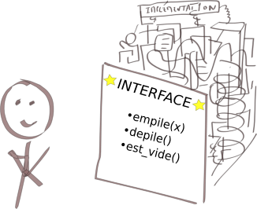

# Les piles

{: .center}

Comme expliqué précédemment, une pile travaille en mode LIFO (Last In First Out).
Pour être utilisée, l'interface d'une pile doit permettre a minima :

- la création d'une pile vide
- l'ajout d'un élément dans la pile (qui sera forcément au dessus). On dira qu'on **empile**.
- le retrait d'un élément de la pile (qui sera forcément celui du dessus) et le renvoi de sa valeur. On dira qu'on **dépile**.

## Utilisation d'une interface de pile

!!! example "{{ exercice() }}"

    === "Énoncé"

        On considère l'enchaînement d'opérations ci-dessous. Écrire à chaque étape l'état de la pile `p` et la valeur éventuellement renvoyée.

        Bien comprendre que la classe ```Pile()``` et ses méthodes n'existent pas vraiment. Nous *jouons* avec son interface.

        On prendra pour convention que la tête de la pile est à droite.

        ```python
        1. p = Pile()
        2. p.empile(3)
        3. p.empile(5)
        4. p.est_vide()
        4. p.empile(1)
        5. p.depile()
        6. p.depile()
        7. p.empile(9)
        8. p.depile()
        9. p.depile()
        10. p.est_vide()
        ```
    === "Correction"

        {{ correction(True,
        "
        ```python
        1. p = Pile()  # p = None
        2. p.empile(3)   # p = 3
        3. p.empile(5)  # p = 3 5 par convention
        4. p.est_vide()  #  False
        4. p.empile(1)  # p = 3 5 1
        5. p.depile()  # p = 3 5    valeur renvoyée : 1
        6. p.depile()  # p = 3      valeur renvoyée : 5
        7. p.empile(9)  # p = 3 9
        8. p.depile()  # p = 3       valeur renvoyée :9
        9. p.depile()  # p est vide      valeur renvoyée : 3
        10. p.est_vide() # True
        ```
        "
        ) }}

## Implémentation(s) d'une pile

L'objectif est de créer une classe `Pile`. L'instruction `Pile()` créera une pile vide. Chaque objet `Pile` disposera des méthodes suivantes :

- `est_vide()` : indique si la pile est vide.
- `empile()` : insère un élément en haut de la pile.
- `depile()` : renvoie la valeur de l'élément en haut de la pile ET le supprime de la pile.
- `__str__()` : permet d'afficher la pile sous forme agréable (par ex : `|3|6|2|5|`) par `print()`

### À l'aide du type `list` de Python

!!! example "{{ exercice() }}"

    === "Énoncé"

        Créer la classe `Pile` ci-dessus.

        Le type ```list``` de Python est parfaitement adapté. Des renseignements intéressants à son sujet peuvent être trouvés [ici](https://docs.python.org/fr/3/tutorial/datastructures.html#more-on-lists).

    === "Correction :heart:"

        {{ correction(True,
        "
        ```python linenums='1'
        class Pile:
            def __init__(self):
                self.data = []

            def est_vide(self):
                return len(self.data) == 0


            def empile(self,x):
                self.data.append(x)

            def depile(self):
                if self.est_vide():
                    print('Vous avez essayé de dépiler une pile vide !')
                    return None
                else :
                    return self.data.pop()

            def __str__(self):       # Hors-Programme : pour afficher
                s = '|'              # convenablement la pile avec print(p)
                for k in self.data :
                    s = s + str(k) + '|'
                return s

            def __repr__(self):       # Hors-Programme : pour afficher
                s = '|'              # convenablement la pile avec p
                for k in self.data :
                    s = s + str(k) + '|'
                return s
        ```
        Test de l'implémentation :
        ```python
        >>> p = Pile()
        >>> p.empile(5)
        >>> p.empile(3)
        >>> p.empile(7)
        >>> p
        |5|3|7|
        ```

        "
        ) }}

### À l'aide d'une liste chaînée et de la classe `Cellule`

Précédemment nous avons créé la classe `Cellule` :

```python linenums='1'
class Cellule :
    def __init__(self, contenu, suivante):
        self.contenu = contenu
        self.suivante = suivante
```

!!! example "{{ exercice() }}"

    === "Énoncé"

    À l'aide cette classe, re-créer une classe `Pile` disposant exactement de la même interface que dans l'exercice précédent.

    === "Correction :heart:"

        {{ correction(True,
        "
        ```python linenums='1'
        class Pile:
            def __init__(self):
                self.data = None

            def est_vide(self):
                return self.data == None

            def empile(self, val):
                self.data = Cellule(val, self.data)

            def depile(self):
                v = self.data.contenu #on récupère la valeur à renvoyer
                self.data = self.data.suivante  # on supprime la 1ère cellule
                return v

            def __str__(self):
                s = '|'
                c = self.data
                while c != None :
                    s += str(c.contenu) + '|'
                    c = c.suivante
                return s

        ```

        Test de l'implémentation :
        ```python
        >>> p = Pile()
        >>> p.empile(5)
        >>> p.empile(3)
        >>> p.empile(7)
        >>> print(p)
        |7|3|5|
        ```
        "
        ) }}

!!!savoir "A retenir"

    Pour l'utilisateur, les interfaces précédentes sont strictement identiques. Il ne peut pas savoir, en les utilisant, l'implémentation qui est derrière.

{: .center}

## Application des piles

!!! example "{{ exercice() }}"

    === "Énoncé"

        Simulez une gestion de l'historique de navigation internet, en créant une classe `Nav` qui utilisera une pile.

        Attention, il ne faut pas réinventer la classe `Pile`, mais s'en servir !

        Exemple d'utilisation :
        ```python
        >>> n = Nav()
        >>> n.visite('lemonde.fr')
        page actuelle : lemonde.fr
        >>> n.visite('google.fr')
        page actuelle : google.fr
        >>> n.visite('netflix.fr')
        page actuelle : netflix.fr
        >>> n.back()
        page quittée : netflix.fr
        >>> n.back()
        page quittée : google.fr
        ```

    === "Correction"

        {{ correction(False,
        "
        ```python linenums='1'
        class Nav:
            def __init__(self):
                self.pile = Pile()

            def visite(self, page):
                self.pile.empile(page)
                print('page actuelle :', page)

            def back(self):
                page_quittee = self.pile.depile()
                print('page quittée :', page_quittee)
        ```
        "
        ) }}
